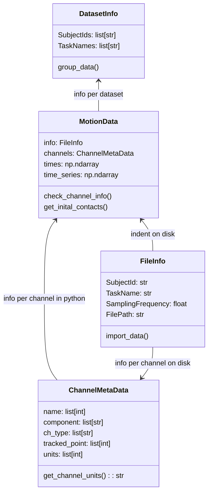

# NGMT

## NeuroGeriatricMotionToolbox

Python based toolbox for processing motion data

## Structure

```markdown
│ngmt                <- Main folder. It is initialized as a Git
│                       repository with a reasonable .gitignore file.
│
├── examples         <- Various scripts, e.g. simulations, plotting, analysis,
│                       The scripts use the `ngmt` folder for their base code.
|
├── info             <- Slides, Paper, basically any document related to the work in progress.
│
├── ngmt             <- Source code for use in this project. Contains functions,
│                       structures and modules that are used throughout
│                       the project and in multiple scripts.
│
├── test             <- Folder containing tests for `ngmt`.
│
├── README.md        <- Top-level README. 
├── LICENSE
├── requirements.txt <- The requirements file for reproducing the analysis environment, e.g.
│                       generated with `pip freeze > requirements.txt`. Might be replaced by
│                       a `environment.yml` file for Anaconda.
├── setup.py         <- makes project pip installable (pip install -e .) so src can be imported
|
└── .gitignore       <- focused on Python VS Code
```

## Realation of data classes


## Authors

[Masoud Abedinifar](https://github.com/masoudabedinifar), [Robbin Romijnders](https://github.com/rmndrs89) & [Julius Welzel](https://github.com/JuliusWelzel)
