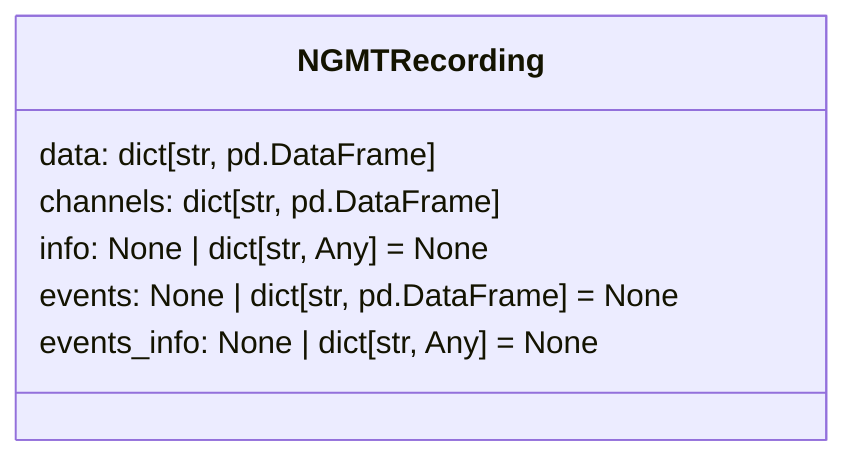

[](https://codecov.io/gh/neurogeriatricskiel/NGMT)
[](https://github.com/neurogeriatricskiel/NGMT/actions/workflows/mkdocs.yml)
[](https://github.com/psf/black)


[](https://github.com/neurogeriatricskiel/NGMT/actions/workflows/test-and-lint.yml)

# NGMT


Welcome to the NeuroGeriatricMotionToolbox (NGMT). We are a Python based toolbox for processing motion data.

> The toolbox is currently under development and is not yet ready for use.

The toolbox is aimed at a wide variety of motion researchers who want to use open souce software to process their data.
We have implemented a wide variety of functions to process motion data, such as:
-   Gait sequence detection (GSD)
-   Inital contact detection (ICD)
-   More to follow ...

The idea is that various motion data can be loaded into our dedicated dataclasses which rely on principles from the [Motion-BIDS](https://bids-specification.readthedocs.io/en/latest/modality-specific-files/motion.html) standard.

## Data classes
### Data classes: conceptual framework

Motion data is recorded with many different systems and modalities, each with their own proprietary data format. NGMT deals with this by organizing both data and metadata in a [BIDS-like format](https://bids-specification.readthedocs.io/en/stable/modality-specific-files/motion.html). The BIDS format suggests that [motion recording data](https://bids-specification.readthedocs.io/en/stable/modality-specific-files/motion.html#motion-recording-data) from a single tracking system is organized in a single `*_tracksys-<label>_motion.tsv` file. 

> [!NOTE]  
> A tracking system is defined as a group of motion channels that share hardware properties (the recording device) and software properties (the recording duration and number of samples).

In NGMT, data from a single tracking system is therefore loaded into a single `pandas.DataFrame`. The column headers of this `pandas.DataFrame` refer to the channels, and the corresponding [channels information](https://bids-specification.readthedocs.io/en/stable/modality-specific-files/motion.html#channels-description-_channelstsv) is likewise available as a `pandas.DataFrame`.

Similarly, if any [events](https://bids-specification.readthedocs.io/en/stable/modality-specific-files/task-events.html) are available for the given recording, these are loaded into a single `pandas.DataFrame` for each tracking system as well.

### Data classes: in practice
These concepts are translated into a NGMT dataclass for each recording: `NGMTRecording`:

 A recording consists of the motion data from one or more tracking systems, where each tracking system may consist motion data from one or more tracked points. Therefore, the motion data (`NGMTRecording.data`) are organized as a dictionary where the dictionary keys refer to the tracking systems, and the corresponding values the actual (raw) data as a `pandas.DataFrame`. The description of data channels (`NGMTRecording.channels`) is availabe as a dictionary with the same keys, and the values contain the channels description.
```python
>>> from ngmt.datasets import mobilised
>>> file_name = "/mnt/neurogeriatrics_data/Mobilise-D/rawdata/sub-3011/Free-living/data.mat"
>>> recording = mobilised.load_recording(file_name, tracking_systems=["SU", "SU_INDIP"], tracked_points=["LowerBack"])
>>> recording.data
{'SU':         LowerBack_ACCEL_x  ...  LowerBack_BARO_n/a
0                0.967784  ...         1011.628100
1                0.969667  ...         1011.628400
...                   ...  ...                 ...
993022           0.970579  ...         1012.078703
993023           0.960542  ...         1002.580321

[993024 rows x 10 columns], 'SU_INDIP':         LowerBack_ACCEL_x  ...  LowerBack_MAGN_z
0                0.967986  ...         -5.902833
1                0.963671  ...          9.501037
...                   ...  ...               ...
993022           0.951656  ...        -17.987983
993023           0.955107  ...        -18.050600

[993024 rows x 9 columns]}
>>> recording.channels
{'SU':                  name type component tracked_point  units  sampling_frequency
0   LowerBack_ACCEL_x  Acc         x     LowerBack      g               100.0
1   LowerBack_ACCEL_y  Acc         y     LowerBack      g               100.0
2   LowerBack_ACCEL_z  Acc         z     LowerBack      g               100.0
3  LowerBack_ANGVEL_x  Gyr         x     LowerBack  deg/s               100.0
4  LowerBack_ANGVEL_y  Gyr         y     LowerBack  deg/s               100.0
5  LowerBack_ANGVEL_z  Gyr         z     LowerBack  deg/s               100.0
6    LowerBack_MAGN_x  Mag         x     LowerBack     µT               100.0
7    LowerBack_MAGN_y  Mag         y     LowerBack     µT               100.0
8    LowerBack_MAGN_z  Mag         z     LowerBack     µT               100.0
9  LowerBack_BARO_n/a  Bar       n/a     LowerBack    hPa               100.0, 'SU_INDIP':                  name type component tracked_point  units  sampling_frequency
0   LowerBack_ACCEL_x  Acc         x     LowerBack      g               100.0
1   LowerBack_ACCEL_y  Acc         y     LowerBack      g               100.0
2   LowerBack_ACCEL_z  Acc         z     LowerBack      g               100.0
3  LowerBack_ANGVEL_x  Gyr         x     LowerBack  deg/s               100.0
4  LowerBack_ANGVEL_y  Gyr         y     LowerBack  deg/s               100.0
5  LowerBack_ANGVEL_z  Gyr         z     LowerBack  deg/s               100.0
6    LowerBack_MAGN_x  Mag         x     LowerBack     µT               100.0
7    LowerBack_MAGN_y  Mag         y     LowerBack     µT               100.0
8    LowerBack_MAGN_z  Mag         z     LowerBack     µT               100.0}
```

> [!NOTE]  
> In the examples you find a [tutorial (the basics of NGMT)](https://neurogeriatricskiel.github.io/NGMT/00_tutorial_basics/) that explains the basics of the dataclass and how to work with them.

## Documentation
The full documentation can be found [here](https://neurogeriatricskiel.github.io/NGMT/).

## Installation
The toolbox has been released on [pypi](https://pypi.org/project/ngmt/) and can be installed via pip:
```bash
pip install ngmt
```
It requires Python 3.10 or higher.

## Authors

[Masoud Abedinifar](https://github.com/masoudabedinifar), [Julius Welzel](https://github.com/JuliusWelzel), [Walter Maetzler](mailto:w.maetzler@neurologie.uni-kiel.de), [Clint Hansen](mailto:c.hansen@neurologie.uni-kiel.de) & [Robbin Romijnders](https://github.com/rmndrs89)

