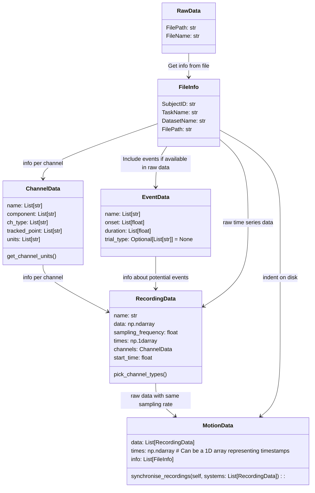

[](https://codecov.io/gh/neurogeriatricskiel/NGMT)
[](https://github.com/neurogeriatricskiel/NGMT/actions/workflows/mkdocs.yml)
[](https://github.com/psf/black)


[](https://github.com/neurogeriatricskiel/NGMT/actions/workflows/test-and-lint.yml)

# NGMT


Welcome to the NeuroGeriatricMotionToolbox (NGMT). We are a Python based toolbox for processing motion data.

> The toolbox is currently under development and is not yet ready for use.

The toolbox is aimed at a wide variety of motion researchers who want to use open souce software to process their data.
We have implemented a wide variety of functions to process motion data, such as:
-   Gait sequence detection (GSD)
-   Inital contact detection (ICD)
-   More to follow ...

The idea is that various motion data can be loaded into our dedicated dataclasses which rely on principles from the [Motion-BIDS](https://bids-specification.readthedocs.io/en/latest/modality-specific-files/motion.html) standard.

## Relation of data classes


This is the planned class structure for motion data. Data from any file format can ultimately be imported into the `MotionData` class. The `MotionData` object contains a `FileInfo` object. The `FileInfo` object contains information about the file, such as the subject ID, the task name, the project name and the file path. The `MotionData` class also contains a list of `RecordingData` objects.

Each `RecordingData` object contains the raw data, the sampling rate, the time stamps and the channel info (`ChannelData`) of a tracking system. It is up to the user how to group the source data into a tracking system.
The `RecordingData` object can also contain information about events. The `EventData` objects stores information about events such as onset or duration.

The `ChannelData` object is used to store the channel name, the channel type, the channel units and the tracked point.

## Documentation
The full documentation can be found [here](https://neurogeriatricskiel.github.io/NGMT/).

## Installation
The toolbox has been released on [pypi](https://pypi.org/project/ngmt/) and can be installed via pip:
```bash
pip install ngmt
```
It requires Python 3.10 or higher.

## Authors

[Masoud Abedinifar](https://github.com/masoudabedinifar), [Clint Hansen](mailto:c.hansen@neurologie.uni-kiel.de), [Walter Maetzler](mailto:w.maetzler@neurologie.uni-kiel.de), [Robbin Romijnders](https://github.com/rmndrs89) & [Julius Welzel](https://github.com/JuliusWelzel)
