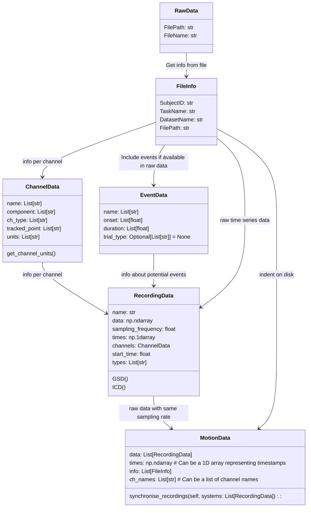

# NGMT

## NeuroGeriatricMotionToolbox

Python based toolbox for processing motion data

## Structure

```markdown
│ngmt                <- Main folder. It is initialized as a Git
│                       repository with a reasonable .gitignore file.
│
├── examples         <- Various scripts, e.g. simulations, plotting, analysis,
│                       The scripts use the `ngmt` folder for their base code.
|
├── info             <- Slides, Paper, basically any document related to the work in progress.
│
├── ngmt             <- Source code for use in this project. Contains functions,
│                       structures and modules that are used throughout
│                       the project and in multiple scripts.
│
├── test             <- Folder containing tests for `ngmt`.
│
├── README.md        <- Top-level README. 
├── LICENSE
├── requirements.txt <- The requirements file for reproducing the analysis environment, e.g.
│                       generated with `pip freeze > requirements.txt`. Might be replaced by
│                       a `environment.yml` file for Anaconda.
├── setup.py         <- makes project pip installable (pip install -e .) so src can be imported
|
└── .gitignore       <- focused on Python VS Code
```

## Relation of data classes


This is the planned class structure for motion data. Data from any file format can ultimately be imported into the `MotionData` class. The `MotionData` object contains a `FileInfo` object. The `FileInfo` object contains information about the file, such as the subject ID, the task name, the project name and the file path. The `MotionData` class also contains a list of `RecordingData` objects. 

Each `RecordingData` object contains the raw data, the sampling rate, the time stamps and the channel info (`ChannelData`) of a tracking system. It is up to the user how to group the source data into a tracking system.
The `RecordingData` object can also contain information about events. The `EventData` objects stores information about events such as onset or duration.

The `ChannelData` object is used to store the channel name, the channel type, the channel units and the tracked point.

## Formatting
The code uploaded here follows the latest black style guide. Please make sure to format your code accordingly before uploading it.
To do this, install black with `pip install black` and run `black .` in the root directory of the project.

## Authors

[Masoud Abedinifar](https://github.com/masoudabedinifar), [Robbin Romijnders](https://github.com/rmndrs89) & [Julius Welzel](https://github.com/JuliusWelzel)
