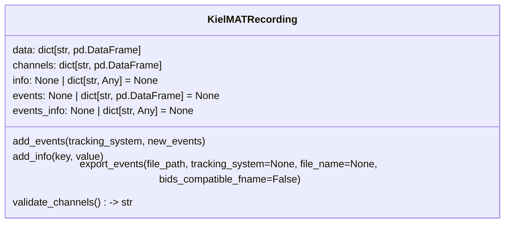

In the following, the KielMAT dataclass is described. The dataclass is used to store motion data in a standardized way. We provide a small set of import functions, each of which returns a `pandas.DataFrame` or a dict. Users should easily be able to write their own import functions to get their data into the provided dataclass (this step might take some thinking). After the data is in the dataclass, running functions on the data from our toolbox should be really straightforward.

 A recording consists of the motion data from one or more tracking systems, where each tracking system may consist motion data from one or more tracked points. Therefore, the motion data (`KielMATRecording.data`) are organized as a dictionary where the dictionary keys refer to the tracking systems, and the corresponding values the actual (raw) data as a `pandas.DataFrame`. The description of data channels (`KielMATRecording.channels`) is availabe as a dictionary with the same keys, and the values contain the channels description.

::: utils.kielmat_dataclass