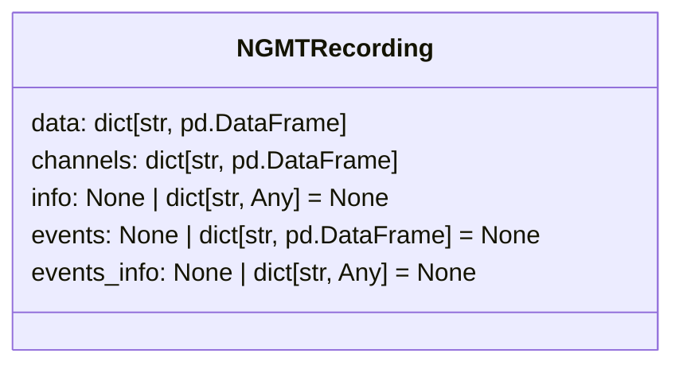

In the following the NGMT dataclasses are described.
The dataclasses are used to store motion data in a standardized way. We provide some small set of import functions, each of which returns a dataclass.
User should easily be able to write their own import functions, to get the their data into the provided dataclasses (this step might take some thinking).
After the data is in the dataclasses, running functions on the data from our toolbox should be really straight forward.

## NGMT data class

 A recording consists of the motion data from one or more tracking systems, where each tracking system may consist motion data from one or more tracked points. Therefore, the motion data (`NGMTRecording.data`) are organized as a dictionary where the dictionary keys refer to the tracking systems, and the corresponding values the actual (raw) data as a `pandas.DataFrame`. The description of data channels (`NGMTRecording.channels`) is availabe as a dictionary with the same keys, and the values contain the channels description.

::: utils.data_classes