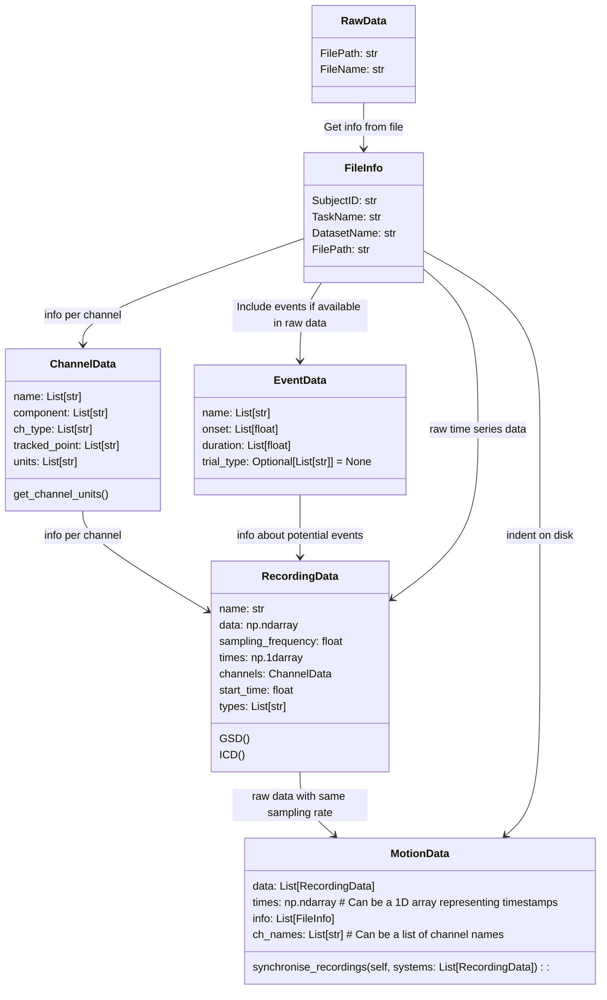

In the following the NGMT dataclasses are described.
The dataclasses are used to store motion data in a standardized way. We provide some small set of import functions, each of which returns a dataclass.
User should easily be able to write their own import functions, to get the their data into the provided dataclasses (this step might take some thinking).
After the data is in the dataclasses, running functions on the data from our toolbox should be really straight forward.

## Relation of data classes

This is the planned class structure for motion data. Data from any file format can ultimately be imported into the `MotionData` class. The `MotionData` object contains a `FileInfo` object. The `FileInfo` object contains information about the file, such as the subject ID, the task name, the project name and the file path. The `MotionData` class also contains a list of `RecordingData` objects. 

Each `RecordingData` object contains the raw data, the sampling rate, the time stamps and the channel info (`ChannelData`) of a tracking system. It is up to the user how to group the source data into a tracking system.
The `RecordingData` object can also contain information about events. The `EventData` objects stores information about events such as onset or duration.

The `ChannelData` object is used to store the channel name, the channel type, the channel units and the tracked point.

::: utils.data_classes