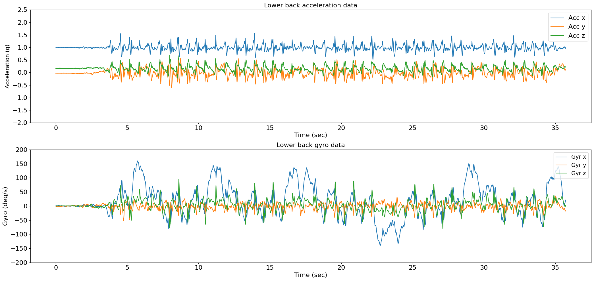

<style>body {text-align: justify}</style>

# Tutorial: Turn Detection

**Author:** Masoud Abedinifar

**Last update:** Mon 25 Mar 2024

## Learning Objectives
By the end of this tutorial:

- You can load data from a recording that belongs to one of the available datasets,
- Apply the Pham Turn Detection algorithm.
- Visualize the results of the algorithm.  
- Interpret the detected turns for further analysis.

# Pham Turn Detection

This example can be referenced by citing the package.

The example illustrates how to use PhamTurnDetection algorithm to detect turns using acceleration and gyro data recorded with a lower back IMU sensor. The turn detection algorithm is implemented using [`ngmt.modules.td._pham`](https://github.com/neurogeriatricskiel/NGMT/tree/main/ngmt/modules/td/_pham.py). This algorithm is based on the research of Pham et al [`1`].

This algorithm aims to detect turns using accelerometer and gyroscope data collected from a lower back 
inertial measurement unit (IMU) sensor. The core of the algorithm lies in the detect method, where turns are identified using accelerometer and gyroscope data. The method first processes the gyro data, converting it to rad/s and computing the variance to identify periods of low variance, which may indicate bias. It then calculates the gyro bias and subtracts it from the original gyro signal to remove any biases. Next, the yaw angle is computed by integrating the gyro data, and zero-crossings indices are found to detect turns. Then, turns are identified based on significant changes in the yaw angle. 

The algorithm also accounts for hesitations, which are brief pauses or fluctuations in the signal that may occur within a turn. Hesitations are marked based on specific conditions related to the magnitude and continuity of the yaw angle changes.

Then, the detected turns are characterized by their start and end times, duration, angle of turn, peak angular velocity, and direction (left or right). Turns with angles equal to or greater than 90 degrees and durations between 0.5 and 10 seconds are selected for further analysis. Finally, the detected turns along with their characteristics (onset, duration, direction, etc.) are stored in a pandas DataFrame (detected_turns attribute).

Optionally, if `plot_results` is set to True, the algorithm generates a plot visualizing the accelerometer and gyroscope data alongside the detected turns. This visualization aids in the qualitative assessment of the algorithm's performance and provides insights into the dynamics of the detected turns.

The method returns an instance of the class with the detected turns stored in a pandas DataFrame format. This DataFrame includes detailed information about each detected turn, allowing for further analysis or integration into larger data processing pipelines.

#### References
[`1`] Pham et al. (2017). Algorithm for Turning Detection and Analysis Validated under Home-Like Conditions in Patients with Parkinson's Disease and Older Adults using a 6 Degree-of-Freedom Inertial Measurement Unit at the Lower Back. Frontiers in Neurology, 8, 135. https://doi.org/10.3389/fneur.2017.00135

## Import Libraries
The necessary libraries such as numpy, matplotlib.pyplot, dataset and PhamTurnDetection turn detection algortihm are imported. Make sure that you have all the required libraries and modules installed before running this code. You also may need to install the `ngmt` library and its dependencies if you haven't already.

```python
import numpy as np
import pandas as pd
import matplotlib.pyplot as plt
from ngmt.datasets import keepcontrol
from ngmt.modules.td import PhamTurnDetection
```

## Data Preparation

To implement Pham Turn Detection algorithm, we load example data.


```python
# The 'file_path' variable holds the absolute path to the data file
file_path = (
    r"C:\Users\Project\Desktop\bigprojects\neurogeriatrics_data\Keep Control\Data\lab dataset\raw data\sub-pp002\motion\sub-pp002_task-walkTurn_tracksys-imu_motion.tsv"
)

# In this example, we use "imu" as tracking_system and "pelvis" as tracked points.
tracking_sys = "imu"
tracked_points = {tracking_sys: ["pelvis"]}

# The 'keepcontrol.load_recording' function is used to load the data from the specified file_path
recording = keepcontrol.load_recording(
    file_name=file_path, tracking_systems=[tracking_sys], tracked_points=tracked_points
)

# Load lower back acceleration data
acceleration_data = recording.data[tracking_sys][
    ["pelvis_ACC_x", "pelvis_ACC_y", "pelvis_ACC_z"]
]

# Load lower back gyro data
gyro_data = recording.data[tracking_sys][
    ["pelvis_ANGVEL_x", "pelvis_ANGVEL_y", "pelvis_ANGVEL_z"]
]

# Print acceleration and gyro data
print(f"acceleration_data (g): {acceleration_data}")
print(f"gyro_data (deg/s): {gyro_data}")
```
acceleration_data (g):

                        pelvis_ACC_x      pelvis_ACC_y      pelvis_ACC_z
            0           0.983901          -0.032714         0.164542
            1           0.992177          -0.027832         0.171870
            2           0.993660          -0.026852         0.163584
            3           0.991220          -0.025391         0.171870
            4           0.984858          -0.030754         0.167977
            ...         ...                ...              ...
            7141        0.984380           0.115229         0.228036
            7142        0.982897           0.116690         0.218751
            7143        0.966298           0.100583         0.217772
            7144        0.957019           0.091299         0.211923
            7145        0.957019           0.089839         0.211423

[7146 rows x 3 columns]

gyro_data (deg/s):        

                        pelvis_ANGVEL_x     pelvis_ANGVEL_y     pelvis_ANGVEL_z
            0           0.351765            -0.437449           -0.087013
            1          -0.087941            -0.698968            0.174026
            2           0.698645            -1.573867           -0.174026
            3           0.087941            -1.661039           -0.786015
            4           0.874528            -0.611795           -0.350952
            ...         ...                 ...                 ...
            7141        15.560731           -17.223774          -0.699003
            7142        16.699083           -17.310947          -0.261038
            7143        18.272255           -17.574051           0.524977
            7144        18.970900           -18.185846           1.922982
            7145        21.071722           -16.786325           2.534972

[7146 rows x 3 columns]

#### Load and show sampling frequency of the data

```python
# Get the corresponding sampling frequency directly from the recording
sampling_frequency = recording.channels[tracking_sys][
    recording.channels[tracking_sys]["name"] == "pelvis_ACC_x"
]["sampling_frequency"].values[0]

# Print sampling frequency and its type
print(f"sampling frequency: {sampling_frequency} Hz")
```
sampling frequency: 200 Hz

## Visualisation of the Data
The raw acceleration and gyro data including components of x, y and z axis are plotted using following code.

```python
# Plot acceleration and gyro in subplots
fig = plt.figure(figsize=(21, 10))

# Subplot 1: Acceleration data
ax1 = plt.subplot(211)
for i in range(3):
    ax1.plot(
        np.arange(len(acceleration_data)) / sampling_frequency,
        acceleration_data[f"pelvis_ACC_{chr(120 + i)}"],
        label=f"Acc {'xyz'[i]}",
    )
ax1.set_title("Lower back acceleration data", fontsize=16)
ax1.set_ylabel(f"Acceleration (g)", fontsize=14)
ax1.set_xlabel(f"Time (sec)", fontsize=16)
ax1.legend(loc="upper right", fontsize=16)
ax1.set_ylim(-2, 2.5)
plt.xticks(fontsize=16)
plt.yticks(fontsize=16)

# Subplot 2: Gyro data
ax2 = plt.subplot(212)
for i in range(3):
    ax2.plot(
        np.arange(len(gyro_data)) / sampling_frequency,
        gyro_data[f"pelvis_ANGVEL_{chr(120 + i)}"],
        label=f"Gyr {'xyz'[i]}",
    )
ax2.set_title("Lower back gyro data", fontsize=16)
ax2.set_ylabel(f"Gyro (deg/s)", fontsize=16)
ax2.set_xlabel(f"Time (sec)", fontsize=16)
ax2.legend(loc="upper right", fontsize=14)
ax2.set_ylim(-200, 200)
plt.xticks(fontsize=16)
plt.yticks(fontsize=16)
fig.tight_layout()
plt.show()
```


    

## Applying Pham Turn Detection Algorithm
Now, we are running Pham turn detection algorithm from pham module [`NGMT.ngmt.modules.td._pham.PhamTurnDetection`](https://github.com/neurogeriatricskiel/NGMT/tree/main/ngmt/modules/td/_pham.py) to detect turns.

The following code first prepares the input data by combining acceleration and gyro data into a single DataFrame called `input_data`.

Then, in order to apply turn detection algorithm, an instance of the PhamTurnDetection class is created using the constructor, `PhamTurnDetection()`. The `pham` variable holds this instance, allowing us to access its methods. The inputs of the algorithm are as follows:

- **Input Data:** `data` Includes accelerometer and gyro data (N, 6) for x, y, and z axes. in pandas Dataframe format.
- **Sampling Frequency:** `sampling_freq_Hz` is the sampling frequency of the data, defined in Hz.
- **Plot Results:** `plot_results`, if set to True, generates a plot showing the detected turns on the data. The default is False. The onset is represented with the vertical red line and the grey area represents the duration of the turns detected by the algorithm.

```python
# Put acceleration and gyro data in the input data as pandas Dataframe which will be used as input of the algorithm
input_data = [acceleration_data, gyro_data]

# Concatenate acceleration_data and gyro_data along axis=1 (columns)
input_data = pd.concat([acceleration_data, gyro_data], axis=1)

# Create an instance of the PhamTurnDetection class
pham = PhamTurnDetection()

# Call the turn detection using pham.detect
pham = pham.detect(
    data=input_data, sampling_freq_Hz=sampling_frequency, plot_results= True
)
```


The turn information are stored in the 'detected_turns' attribute, which is a pandas DataFrame in BIDS format with the following columns:

- **onset**: Start of the turn event in seconds.
- **duration**: Duration of the turn event in seconds.
- **event_type**: Type of event which is turn.
- **direction_of_turn**: Direction of turn which is either left or right.
- **angle_of_turn_deg**: Angle of turns in degrees.
- **peak_angular_velocity**: Peak angular velocity (deg/s).
- **tracking_systems**: Tracking system which is 'imu' for this example.
- **tracked_points**: Tracked points on the body which is 'LowerBack' for this example.

```python
# Print events and their corresponding information
print(f"turn event information: {pham.detected_turns}")
```

    turn event information:    
                    onset   duration   event_type   direction_of_turn   angle_of_turn_deg   peak_angular_velocity   tracking_systems   tracked_points 
    0               4.04    3.26       turn         right               197.55              159.45                  imu                LowerBack     
    1               9.44    3.35       turn         right               199.69              144.67                  imu                LowerBack     
    2               15.99   2.61       turn         right               201.29              136.11                  imu                LowerBack   
    3               22.26   2.39       turn         left               -199.08              140.47                  imu                LowerBack        
    4               27.24   3.66       turn         right               210.34              149.13                  imu                LowerBack      

 
## Detailed Visualization of the Detected Turns

To get a better understanding of the results, we can plot the data and the first detected turn. The red vertical line shows the onset and the grey area shows the duration of the first turn.

```python
# Figure 
fig = plt.figure(figsize=(21, 10))

# Subplot 1: Acceleration data
ax1 = plt.subplot(211)
for i in range(3):
    ax1.plot(
        np.arange(len(acceleration_data)) / sampling_frequency,
        acceleration_data[f"pelvis_ACC_{chr(120 + i)}"],
    )
for i in range(len(pham.detected_turns)):
    onset = pham.detected_turns['onset'][0]
    duration = pham.detected_turns['duration'][0]
    ax1.axvline(x=onset, color='r')
    ax1.axvspan(onset, (onset + duration), color='grey')
ax1.set_title("Detected Turns", fontsize=20)
ax1.set_ylabel(f"Acceleration (g)", fontsize=16)
ax1.set_xlabel(f"Time (sec)", fontsize=16)
ax1.legend(["Acc x", "Acc y", "Acc z", "Turn oset", "Turn duration"], loc="upper right", fontsize=14)
ax1.set_ylim(-1, 2)
start_limit = pham.detected_turns["onset"][0] - 2
end_limit = pham.detected_turns["onset"][0] + pham.detected_turns["duration"][0] + 2
ax1.set_xlim(start_limit, end_limit)
plt.xticks(fontsize=16)
plt.yticks(fontsize=16)

# Subplot 2: Gyro data
ax2 = plt.subplot(212)
for i in range(3):
    ax2.plot(
        np.arange(len(gyro_data)) / sampling_frequency,
        gyro_data[f"pelvis_ANGVEL_{chr(120 + i)}"],
    )
for i in range(len(pham.detected_turns)):
    onset = pham.detected_turns['onset'][0]
    duration = pham.detected_turns['duration'][0]
    ax2.axvline(x=onset, color='r')
    ax2.axvspan(onset, (onset + duration), color='grey')
ax2.set_ylabel(f"Gyro (deg/s)", fontsize=16)
ax2.set_xlabel(f"Time (sec)", fontsize=16)
start_limit = pham.detected_turns["onset"][0] - 2
end_limit = pham.detected_turns["onset"][0] + pham.detected_turns["duration"][0] + 2
ax2.set_xlim(start_limit, end_limit)
ax2.legend(["Gyr x", "Gyr y", "Gyr z", "Turn onset", "Turn duration"], loc="upper right", fontsize=14)
ax2.set_ylim(-200, 200)
plt.xticks(fontsize=16)
plt.yticks(fontsize=16)
fig.tight_layout()
plt.show()
```


