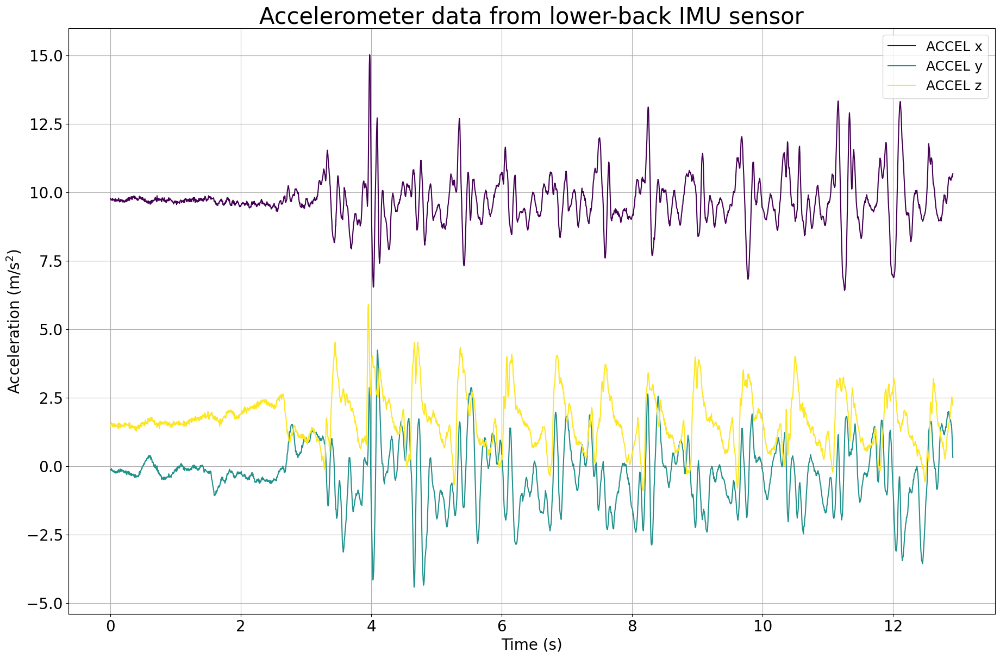
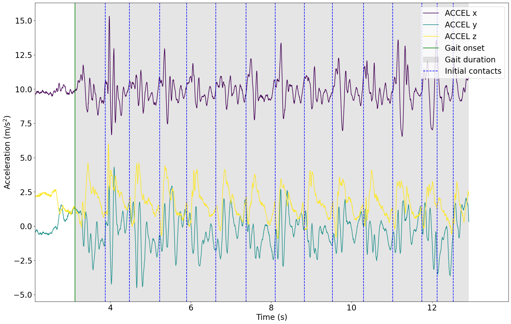

# Tutorial: Initial Contact Detection

**Author:** Masoud Abedinifar

**Last update:** Tue 01 Oct 2024

## Learning objectives
By the end of this tutorial, you will be able to: 

- You can load data from a recording that belongs to one of the available datasets,
- Apply the Paraschiv-Ionescu initial contact detection algorithm to accelerometer data.  
- Visualize the results of initial contact detection.  
- Interpret the detected initial contacts for further analysis.

# Paraschiv Initial Contact Detection

This example can be referenced by citing the package.

The example illustrates how the Paraschiv initial contact detection algorithm is used to detect initial contacts using body acceleration recorded with a triaxial accelerometer worn or fixed on the lower back. The initial contact detection algorithm is implemented in the main module [`kielmat.modules.icd._paraschiv`](https://github.com/neurogeriatricskiel/KielMAT/tree/main/kielmat/modules/icd/_paraschiv.py). This algorithm is based on the research of Paraschiv-Ionescu et al [`1`-`2`].

The algorithm takes accelerometer data as input, specifically the vertical acceleration component, and processes each specified gait sequence independently. The algorithm requires the start and duration of each gait sequence, in the format provided by the Paraschiv-Ionescu gait sequence detection algorithm ([`kielmat.modules.gsd._paraschiv`](https://github.com/neurogeriatricskiel/KielMAT/tree/main/kielmat/modules/gsd/_paraschiv.py)). The sampling frequency of the accelerometer data is also required as another input. Detected gait sequence information is provided as a DataFrame, which consists of the onset and duration of the gait sequences. For each gait sequence, the algorithm applies the Signal Decomposition algorithm for initial contacts. The algorithm handles multiple gait sequences and ensures uniform output by padding the initial contacts lists with NaN values to match the length of the sequence with the maximum number of initial contacts detected among all sequences. Finally, initial contacts information is provided as a DataFrame with columns `onset`, `event_type`, `tracking_systems`, and `tracked_points`.

#### References
[`1`] Paraschiv-Ionescu et al. (2019). Locomotion and cadence detection using a single trunk-fixed accelerometer: validity for children with cerebral palsy in daily life-like conditions. Journal of NeuroEngineering and Rehabilitation, 16(1), 24. https://doi.org/10.1186/s12984-019-0494-z

[`2`] Paraschiv-Ionescu et al. (2020). Real-world speed estimation using a single trunk IMU: methodological challenges for impaired gait patterns. Annual International Conference of the IEEE Engineering in Medicine and Biology Society. IEEE Engineering in Medicine and Biology Society. https://doi.org/10.1109/EMBC44109.2020.9176281

## Import Libraries
The necessary libraries such as numpy, matplotlib.pyplot, dataset (mobilised), Paraschiv-Ionescu gait sequence detection, and Paraschiv-Ionescu initial contact detection algorithms are imported from their corresponding modules. Make sure that you have all the required libraries and modules installed before running this code. You also may need to install the `kielmat` library and its dependencies if you haven't already.


```python
import numpy as np
import matplotlib.pyplot as plt
import os
from pathlib import Path
from kielmat.datasets import keepcontrol
from kielmat.modules.gsd import ParaschivIonescuGaitSequenceDetection
from kielmat.modules.icd import ParaschivIonescuInitialContactDetection
from kielmat.config import cfg_colors
```

## Data Preparation

To implement the Paraschiv-Ionescu initial contact algorithm, we load example data from a KeepControl, which is publicly available on [OpenNeuro](https://openneuro.org/datasets/ds005258). 

The participant was walking at a slow speed for a distance of 20m.

```python
# Dataset path
dataset_path = Path(os.getcwd()) / "_keepcontrol"

# Fetch the dataset
keepcontrol.fetch_dataset(dataset_path)
```    


```python
# In this example, we use "imu" as tracking_system and "pelvis" as tracked points.
tracking_sys = "imu"
tracked_points = {tracking_sys: ["pelvis"]}

# The 'keepcontrol.load_recording' function is used to load the data from the specified file_path
recording = keepcontrol.load_recording(
    dataset_path=dataset_path,
    id="pp002",
    task="walkSlow",
    tracking_systems=[tracking_sys], 
    tracked_points=tracked_points
)

# Load lower back acceleration data
accel_data = recording.data[tracking_sys][
    ["pelvis_ACCEL_x", "pelvis_ACCEL_y", "pelvis_ACCEL_z"]
]

# Get the corresponding sampling frequency directly from the recording
sampling_frequency = recording.channels[tracking_sys][
    recording.channels[tracking_sys]["name"] == "pelvis_ACCEL_x"
]["sampling_frequency"].values[0]
```
#### Data Units and Conversion to SI Units

All input data provided to the modules in this toolbox should adhere to SI units to maintain consistency and accuracy across analyses. This ensures compatibility with the underlying algorithms, which are designed to work with standard metric measurements.

If any data is provided in non-SI units (e.g., acceleration in g instead of m/s²), it is needed that the data to be converted into the appropriate SI units before using it as input to the toolbox. Failure to convert non-SI units may lead to incorrect results or misinterpretation of the output.

For instance:

- **Acceleration:** Convert from g to m/s².

```python
# Get the corresponding unit of the acceleration data
accel_unit = recording.channels[tracking_sys][
    recording.channels[tracking_sys]["name"].str.contains("ACCEL", case=False)
]["units"].iloc[0]

# Check unit of acceleration data
if accel_unit in ["m/s^2"]:
    pass  # No conversion needed
elif accel_unit in ["g", "G"]:
    # Convert acceleration data from "g" to "m/s^2"
    accel_data *= 9.81
    # Update unit of acceleration
    accel_unit = ["m/s^2"]
```

## Visualisation of the Data
The raw acceleration data including components of x, y and z axis is represented.


```python
# Calculate the time values
time = np.arange(len(accel_data)) / (sampling_frequency)

# Create a figure with a specified size
plt.figure(figsize=(22, 14))

# Get colors for raw
colors = cfg_colors["raw"]

# A loop is used to plot data for each accelerometer axis, applying different colors from the color map.
for i in range(3):
    plt.plot(
        time,
        accel_data.iloc[:,i],
        color=colors[i],
        label=f"ACCEL {'xyz'[i]}",
    )

# Add labels and legends
plt.xlabel("Time (s)", fontsize=20)
plt.ylabel("Acceleration (m/s$^{2}$)", fontsize=20)
plt.legend(fontsize=18)

# Add a title with a specified font size
plt.title(
    "Accelerometer data from lower-back IMU sensor",
    fontsize=30,
)

# Customize tick font sizes
plt.xticks(fontsize=20)
plt.yticks(fontsize=20)

# Display a grid for reference
plt.grid(visible=None, which="both", axis="both")

# Show the plot
plt.show()
```


    

    


## Applying Paraschiv-Ionescu Initial Contact Detection Algorithm
Now, we are running Paraschiv-Ionescu initial contact detection algorithm from icd module [`KielMAT.kielmat.modules.icd._paraschiv.ParaschivIonescuInitialContactDetection`](https://github.com/neurogeriatricskiel/KielMAT/tree/main/kielmat/modules/icd/_paraschiv.py) to detect initial contacts throughout the detected gait sequences. For this purpose, we have to first apply Paraschiv-Ionescu gait sequences detection algorithm to identify gait sequences using acceleration data. The gait sequences are detected by Paraschiv gait sequence detection ([`KielMAT.kielmat.modules.gsd._paraschiv.ParaschivIonescuGaitSequenceDetection`](https://github.com/neurogeriatricskiel/KielMAT/tree/main/kielmat/modules/gsd/_paraschiv.py)).

Then, in order to apply Paraschiv-Ionescu initial contact detection algorithm, an instance of the ParaschivIonescuInitialContactDetection class is created using the constructor, `ParaschivIonescuInitialContactDetection()`. The `icd` variable holds the instance, allowing us to access its methods. The inputs of Paraschiv-Ionescu initial contact detection algorithm are as follows:

- **Input Data:** `accel_data` consist of accelerometer data (N, 3) for the x, y, and z axes in pandas Dataframe format. The data should be in SI unit as m/s².
- **Gait Sequences:** `gait_sequences`, consist of gait sequences detected by Paraschiv gait sequence detection ([`KielMAT.kielmat.modules.gsd._paraschiv.ParaschivIonescuGaitSequenceDetection`](https://github.com/neurogeriatricskiel/KielMAT/tree/main/kielmat/modules/gsd/_paraschiv.py)).
- **Sampling Frequency:** `sampling_freq_Hz` is the sampling frequency of the data, defined in Hz, with a default value of 100 Hz.


```python
# Create an instance of the ParaschivIonescuGaitSequenceDetection class
gsd = ParaschivIonescuGaitSequenceDetection()

# Call the gait sequence detection using gsd.detect to detect gait sequences
gsd = gsd.detect(
    accel_data=acceleration_data, sampling_freq_Hz=200, plot_results=False
)

# Gait sequences are stored in gait_sequences_ attribute of gsd
gait_sequences = gsd.gait_sequences_

# Now, use Paraschiv-Ionescu initial contact detection algortihm to find initial contacts within detected gait sequences.
icd = ParaschivIonescuInitialContactDetection()

# Call the initial contact detection using icd.detect
icd = icd.detect(
    accel_data=accel_data,
    gait_sequences=gait_sequences,
    sampling_freq_Hz=200,
    v_acc_col_name="pelvis_ACCEL_x"
)

# Print initial contacts information
print(icd.initial_contacts_)
```

    1 gait sequence(s) detected.
            onset   event_type        duration   tracking_systems
    0       3.425   initial contact   0          None
    1       4.000   initial contact   0          None
    2       4.650   initial contact   0          None
    3       5.350   initial contact   0          None
    4       6.050   initial contact   0          None
    5       6.825   initial contact   0          None
    6       7.500   initial contact   0          None
    7       8.250   initial contact   0          None
    8       8.950   initial contact   0          None
    9       9.700   initial contact   0          None
    10      10.425  initial contact   0          None
    11      11.150  initial contact   0          None
    12      11.900  initial contact   0          None
    

## Visualization of the Detected Initial Contacts

In the following, the raw data of the lower back sensor is plotted with the detected events. The events are plotted as vertical lines. The events are:

- **Gait onset**: Start of the gait sequence
- **Gait duration**: Duration of the gait sequence
- **Initial contacts**: Initial contacts

The gait onset is represented with the vertical green line and the grey area represents the duration of gait sequence detected by the algorithm. The vertical dashed blue lines are representing detected initial contacts within first gait sequence.


```python
# Load lower back acceleration data
acceleration_data = recording.data[tracking_sys][
    ["pelvis_ACCEL_x", "pelvis_ACCEL_y", "pelvis_ACCEL_z"]
]

# Get the corresponding unit of the acceleration data
accel_unit = recording.channels[tracking_sys][
    recording.channels[tracking_sys]["name"].str.contains("ACCEL", case=False)
]["units"].iloc[0]

# Check unit of acceleration data
if accel_unit in ["m/s^2"]:
    pass  # No conversion needed
elif accel_unit in ["g", "G"]:
    # Convert acceleration data from "g" to "m/s^2"
    acceleration_data *= 9.81
    # Update unit of acceleration
    accel_unit = ["m/s^2"]

# Access the first detected gait sequence
first_gait_sequence = gsd.gait_sequences_[gsd.gait_sequences_["event_type"] == "gait sequence"].iloc[0]

# Print information about the first gait sequence
print("First Gait Sequence:", first_gait_sequence)

# Print information about initial contacts within the first gait sequence
ic_within_gait = icd.initial_contacts_[
    icd.initial_contacts_["onset"].between(
        first_gait_sequence["onset"],
        first_gait_sequence["onset"] + first_gait_sequence["duration"],
    )
]
print("\nInitial Contacts within the First Gait Sequence:", ic_within_gait)

# Plot the raw data from the lower back
fig, ax = plt.subplots(figsize=(22, 14))

# Plot raw acceleration data
for i in range(3):
    ax.plot(
        time,
        accel_data.iloc[:,i],
        color=colors[i],
        label=f"ACCEL {'xyz'[i]}",
    )

# Plot the first element of gait sequences
plt.axvline(first_gait_sequence["onset"], color="g", label="Gait onset")
ax.axvspan(
    first_gait_sequence["onset"],
    first_gait_sequence["onset"] + first_gait_sequence["duration"],
    alpha=0.2,
    color="gray",
    label="Gait duration",
)

# Plot the initial contacts within the first gait sequence
for ic_time in ic_within_gait["onset"]:
    ax.axvline(ic_time, color="blue", linestyle="--")

# Customize plot
start_limit = first_gait_sequence["onset"] - 1
end_limit = first_gait_sequence["onset"] + first_gait_sequence["duration"] + 1
ax.set_xlim(start_limit, end_limit)
ax.set_xlabel("Time (s)", fontsize=20)
ax.set_ylabel("Acceleration (m/s$^{2}$)", fontsize=20)
plt.xticks(fontsize=20)
plt.yticks(fontsize=20)
ax.legend(
    ["ACCEL x", "ACCEL y", "ACCEL z", "Gait onset", "Gait duration", "Initial contacts"],
    fontsize=20,
    loc="upper right",
)
plt.show()
```

    First Gait Sequence: 
    onset                      3.125
    duration                   9.775
    event_type         gait sequence
    tracking_system             None
    Name: 0, dtype: object

    Initial Contacts within the First Gait Sequence:      
         onset  event_type          duration    tracking_systems
    0    3.425  initial contact     0           None
    1    4.000  initial contact     0           None
    2    4.650  initial contact     0           None
    3    5.350  initial contact     0           None
    4    6.050  initial contact     0           None
    5    6.825  initial contact     0           None
    6    7.500  initial contact     0           None
    7    8.250  initial contact     0           None
    8    8.950  initial contact     0           None
    9    9.700  initial contact     0           None
    10  10.425  initial contact     0           None
    11  11.150  initial contact     0           None
    12  11.900  initial contact     0           None
    


    

    

