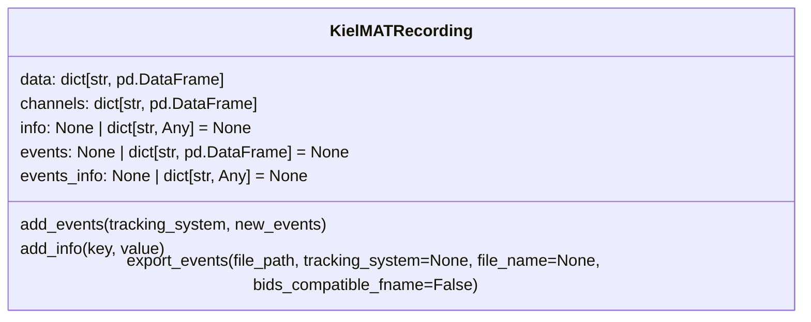

[](https://codecov.io/gh/neurogeriatricskiel/KielMAT)
[](https://github.com/neurogeriatricskiel/KielMAT/actions/workflows/mkdocs.yml)
[](https://github.com/psf/black)


[](https://github.com/neurogeriatricskiel/KielMAT/actions/workflows/test-and-lint.yml)

# KielMAT


Welcome to the KielMotionAnalysisToolbox (KielMAT). We are a Python based toolbox for processing motion data.

The toolbox is aimed at motion researchers who want to use Python-based open-source software to process their data. We have implemented validated algorithms in modules to process motion data, as shown in the table below:


## Overview of Modules

The table below provides an overview of key modules, their functionalities, input data, validation datasets, and outputs.

| Module | Description | Input Data | Validation Dataset | Event Type | Output Parameters |
|--------|-------------|------------|--------------------|------------|-------------------|
| [Gait Sequence Detection](https://neurogeriatricskiel.github.io/KielMAT/modules/gsd/) | Detects gait sequences | 3D accelerations from lower back IMU | [Mobilise-D](https://neurogeriatricskiel.github.io/KielMAT/datasets/mobilised/) and [KeepControl](https://neurogeriatricskiel.github.io/KielMAT/datasets/keepcontrol/) | gait sequence | - |
| [Initial Contact Detection](https://neurogeriatricskiel.github.io/KielMAT/modules/icd/) | Detects initial and final contacts within each gait cycle | 3D accelerations from lower back IMU | [Mobilise-D](https://neurogeriatricskiel.github.io/KielMAT/datasets/mobilised/) and [KeepControl](https://neurogeriatricskiel.github.io/KielMAT/datasets/keepcontrol/) | initial contact, final contact | Temporal parameters (e.g., step time, stride time) |
| [Physical Activity Monitoring](https://neurogeriatricskiel.github.io/KielMAT/modules/pam/) | Monitors physical activity levels | 3D accelerations from wrist IMU | [Fair Park Ⅱ](https://www.fairpark2.eu/) | - | Mean and duration of activity level |
| [Postural Transition Detection](https://neurogeriatricskiel.github.io/KielMAT/modules/ptd/) | Detects sit-to-stand and stand-to-sit transitions | 3D acceleration and gyroscope data from lower back IMU | [KeepControl](https://neurogeriatricskiel.github.io/KielMAT/datasets/keepcontrol/) and [SENSE-PARK](https://pmc.ncbi.nlm.nih.gov/articles/PMC4460963/) | sit-to-stand, stand-to-sit | Spatio-temporal parameters (e.g., postural transition angle) |
| [Turn Detection](https://neurogeriatricskiel.github.io/KielMAT/modules/td/) | Detects turn movements | 3D acceleration and gyroscope data from lower back IMU | [KeepControl](https://neurogeriatricskiel.github.io/KielMAT/datasets/keepcontrol/) and [SENSE-PARK](https://pmc.ncbi.nlm.nih.gov/articles/PMC4460963/) | turn | Spatio-temporal parameters (e.g., turn angle) |


## Units

The table below provides an overview of commonly used value types and their corresponding units. Before starting work with modules in the toolbox, ensure that all data is in standard SI units as specified. This ensures compatibility with the algorithms, which are designed to expect inputs in these units.

| Value             | Unit   | Channel Type  |
|-------------------|--------|---------------|
| Acceleration      | m/s²   | ACCEL         |
| Angular Velocity  | deg/s  | GYRO          |
| Velocity          | m/s    | VEL           |
| Distance          | m      | POS           |
| Time              | s      |               |
| Sampling Rate     | Hz     |               |

## Installation
The toolbox has been released on [pypi](https://pypi.org/project/kielmat/) and can be installed via pip:
```bash
pip install kielmat
```
It requires Python 3.10 or higher.

## Data classes
The idea is that various motion data can be loaded into our dedicated dataclass which rely on principles from the [Motion-BIDS](https://bids-specification.readthedocs.io/en/latest/modality-specific-files/motion.html) standard.

### Data classes: conceptual framework

Motion data is recorded with many different systems and modalities, each with their own proprietary data format. KielMAT deals with this by organizing both data and metadata in a [BIDS-like format](https://bids-specification.readthedocs.io/en/stable/modality-specific-files/motion.html). The BIDS format suggests that [motion recording data](https://bids-specification.readthedocs.io/en/stable/modality-specific-files/motion.html#motion-recording-data) from a single tracking system is organized in a single `*_tracksys-<label>_motion.tsv` file.

> !!! note
> A tracking system is defined as a group of motion channels that share hardware properties (the recording device) and software properties (the recording duration and number of samples).

In KielMAT, data from a single tracking system is therefore loaded into a single `pandas.DataFrame`. The column headers of this `pandas.DataFrame` refer to the channels, and the corresponding [channels information](https://bids-specification.readthedocs.io/en/stable/modality-specific-files/motion.html#channels-description-_channelstsv) is likewise available as a `pandas.DataFrame`.

Similarly, if any [events](https://bids-specification.readthedocs.io/en/stable/modality-specific-files/task-events.html) are available for the given recording, these are loaded into a single `pandas.DataFrame` for each tracking system as well. The events derived from the toolbox can be exported to a BIDS like '*_events.tsv' file.

### Data classes: in practice
These concepts are translated into a KielMAT dataclass for each recording: `KielMATRecording`:

 A recording consists of the motion data from one or more tracking systems, where each tracking system may consist motion data from one or more tracked points. Therefore, the motion data (`KielMATRecording.data`) are organized as a dictionary where the dictionary keys refer to the tracking systems, and the corresponding values the actual (raw) data as a `pandas.DataFrame`. The description of data channels (`KielMATRecording.channels`) is availabe as a dictionary with the same keys, and the values contain the channels description.

#### Example 1: Custom Dataset
You can create a KielMATRecording instance from your own motion data.  Suppose you have motion data from your tracking system in a CSV file structured as follows:

```python
      timestamp  YourTrackedPoint_ACCEL_x  YourTrackedPoint_ACCEL_y  YourTrackedPoint_ACCEL_z  YourTrackedPoint_GYRO_x  YourTrackedPoint_GYRO_y  YourTrackedPoint_GYRO_z
0     0.00       0.1                       0.2                       9.8                       0.01                     0.02                     0.03
1     0.01       0.1                       0.2                       9.8                       0.01                     0.02                     0.03
...   ...        ...                       ...                       ...                       ...                      ...                      ...
```

You can create a `KielMATRecording` as follows:

```python
import pandas as pd
from kielmat.utils.kielmat_dataclass import KielMATRecording

# Load your motion data into a pandas DataFrame
motion_data = pd.read_csv("path_to_your_data.csv")

# Calculate the sampling frequency using the timestamp column
time_diff = motion_data["timestamp"].diff().dropna()  # Calculate time differences
sampling_frequency = 1 / time_diff.mean()  # Sampling frequency in Hz

# Drop the timestamp column, as it is not needed in the motion data
motion_data = motion_data.drop(columns=["timestamp"])

# Define the tracking system and tracked point names
tracking_system = "YourTrackingSystem"
tracked_point = "YourTrackedPoint"

# Create the data dictionary
data = {tracking_system: motion_data}

# Create the channels DataFrame
channels_info = pd.DataFrame({
    "name": [f"{tracked_point}_ACCEL_x", f"{tracked_point}_ACCEL_y", 
             f"{tracked_point}_ACCEL_z", f"{tracked_point}_GYRO_x", 
             f"{tracked_point}_GYRO_y", f"{tracked_point}_GYRO_z"],
    "type": ["ACCEL", "ACCEL", "ACCEL", "GYRO", "GYRO", "GYRO"],
    "component": ["x", "y", "z", "x", "y", "z"],
    "tracked_point": [tracked_point] * 6,
    "units": ["g", "g", "g", "deg/s", "deg/s", "deg/s"],
    "sampling_frequency": [sampling_frequency] * 6
})

# Create the channels dictionary
channels = {tracking_system: channels_info}

# Create a KielMATRecording instance
recording = KielMATRecording(data=data, channels=channels)

# Print data and channels information
print(recording.data)
print(recording.channels)
```
```python
   {'YourTrackingSystem':    YourTrackedPoint_ACCEL_x  YourTrackedPoint_ACCEL_y  \
   0                         0.1                       0.2   
   1                         0.1                       0.2   
   ...                       ...                       ...    

      YourTrackedPoint_ACCEL_z  YourTrackedPoint_GYRO_x  YourTrackedPoint_GYRO_y  \
   0                       9.8                     0.01                     0.02   
   1                       9.8                     0.01                     0.02   
   ...                     ...                     ...                      ...      

      YourTrackedPoint_GYRO_z  
   0                     0.03  
   1                     0.03  
   ...                   ...  }

   {'YourTrackingSystem':             name component   type     tracked_point  units  \
   0  YourTrackedPoint_ACCEL_x         x  ACCEL  YourTrackedPoint      g   
   1  YourTrackedPoint_ACCEL_y         y  ACCEL  YourTrackedPoint      g   
   2  YourTrackedPoint_ACCEL_z         z  ACCEL  YourTrackedPoint      g   
   3   YourTrackedPoint_GYRO_x         x   GYRO  YourTrackedPoint  deg/s   
   4   YourTrackedPoint_GYRO_y         y   GYRO  YourTrackedPoint  deg/s   
   5   YourTrackedPoint_GYRO_z         z   GYRO  YourTrackedPoint  deg/s   

      sampling_frequency  
   0               100.0  
   1               100.0  
   2               100.0  
   3               100.0  
   4               100.0  
   5               100.0  }
```

#### Example 2: Mobilise-D Dataset
You can also load data from the [`Mobilise-D`](https://neurogeriatricskiel.github.io/KielMAT/datasets/mobilised/) dataset, one of the datasets available in the toolbox. To do this, use the `load_recording()` function in the `kielmat.datasets.mobilised`.

```python
import numpy as np
from pathlib import Path
from kielmat.datasets import mobilised

# Load data from the Mobilise-D dataset
recording = mobilised.load_recording()

# The keys of the recording
recording.__dict__.keys()
dict_keys(['data', 'channels', 'info', 'events', 'events_info'])

# Print the data information
print(recording.data)
{'SU':         LowerBack_ACCEL_x  LowerBack_ACCEL_y  LowerBack_ACCEL_z  \
0              0.933334           0.084820          -0.302665   
1              0.932675           0.084844          -0.300591   
2              0.932350           0.082886          -0.310576   
3              0.929716           0.081786          -0.303551   
4              0.932825           0.077879          -0.308859   
...                   ...                ...                ...   
693471        -0.192553          -0.016052          -0.984290   
693472        -0.189575          -0.016449          -0.988130   
693473        -0.191176          -0.017954          -0.983820   
693474        -0.189691          -0.014539          -0.986376   
693475        -0.192993          -0.015306          -0.989452   

               LowerBack_GYRO_x  LowerBack_GYRO_y  LowerBack_GYRO_z  \
0              5.600066          1.120697          0.489152   
1              5.440734          1.401663          0.279477   
2              5.196312          1.168802          0.435765   
3              5.553083          1.116346          0.383447   
4              5.437505          0.892803         -0.150115   
...                  ...               ...               ...   
693471        -0.225874          0.832856          0.704711   
693472        -0.393438          0.598116          0.522755   
693473        -0.430749          0.417541          0.282336   
693474        -0.279277          0.559122          0.418693   
693475        -0.563741          0.478618          0.411295   

               LowerBack_MAGN_x  LowerBack_MAGN_y  LowerBack_MAGN_z  \
0             -93.972011        -25.023998         44.675028   
1             -93.958012        -25.016007         44.610055   
2             -93.946010        -25.000014         44.520078   
3             -93.938007        -24.980018         44.411097   
4             -93.935003        -24.957021         44.287113   
...                  ...               ...               ...   
693471        -50.718928        -36.997006         34.111960   
693472        -50.649929        -37.003005         34.072972   
693473        -50.579936        -37.008003         34.044986   
693474        -50.515946        -37.011000         34.031004   
693475        -50.460961        -37.010996         34.035025   

               LowerBack_BARO_n/a  
0              990.394600  
1              990.395100  
2              990.395600  
3              990.396199  
4              990.396700  
...                    ...  
693471         990.204600  
693472         990.204900  
693473         990.205200  
693474         990.205500  
693475         990.205800  

[693476 rows x 10 columns]}

# Print the channels information 
print(recording.channels)
{'SU':                  
   name                 type  component   tracked_point  units    sampling_frequency
0  LowerBack_ACCEL_x    Acc   x           LowerBack      g        100.0
1  LowerBack_ACCEL_y    Acc   y           LowerBack      g        100.0
2  LowerBack_ACCEL_z    Acc   z           LowerBack      g        100.0
3  LowerBack_ANGVEL_x   Gyr   x           LowerBack      deg/s    100.0
4  LowerBack_ANGVEL_y   Gyr   y           LowerBack      deg/s    100.0
5  LowerBack_ANGVEL_z   Gyr   z           LowerBack      deg/s    100.0
6  LowerBack_MAGN_x     Mag   x           LowerBack      µT       100.0
7  LowerBack_MAGN_y     Mag   y           LowerBack      µT       100.0
8  LowerBack_MAGN_z     Mag   z           LowerBack      µT       100.0
9  LowerBack_BARO_n/a   Bar   n/a         LowerBack      hPa      100.0, 
}
```

> [!NOTE]
> In the examples you find a [tutorial (Load data into KielMAT)](https://neurogeriatricskiel.github.io/KielMAT/examples/basic_00_load_Data_into_KielMAT/) that explains the basics of the dataclass and how to work with them.

## Contributing
We welcome contributions to KielMAT! Please refer to our [contributing guide](https://neurogeriatricskiel.github.io/KielMAT/contributing) for more details.

## Paper
The paper has been recently published in JOSS. You can find the paper [here](https://doi.org/10.21105/joss.06842).

## Authors

[Masoud Abedinifar](https://github.com/masoudabedinifar), [Clint Hansen](mailto:c.hansen@neurologie.uni-kiel.de), [Walter Maetzler](mailto:w.maetzler@neurologie.uni-kiel.de), [Robbin Romijnders](https://github.com/rmndrs89) & [Julius Welzel](https://github.com/JuliusWelzel)