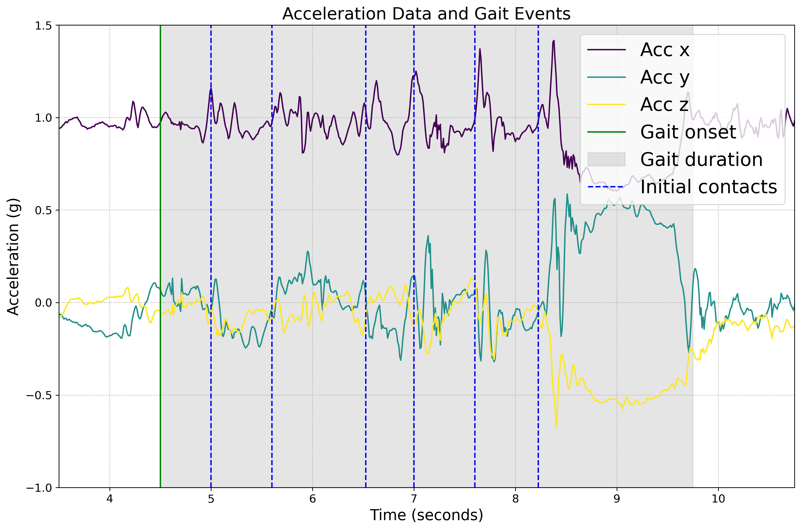

# Summary
The NeuroGeriatric Motion Toolbox (NGMT) is an open-source Python-based toolbox designed for processing human motion data, following open-science practices. NGMT offers a wide range of algorithms for the processing of motion data in neuroscience and biomechanics and currently includes implementations for gait sequence detection, initial contact detection, physical activity monitoring, sit to stand and stand to sit detection algorithms. These algorithms aid in identifying patterns in human motion data on different time scales. Some of the toolbox algorithms have been developed and validated in clinical cohorts, allowing extracted patters to be used in a clinical context. The modular design of NGMT allows the toolbox to be easily extended to incorporate relevant algorithms which will be developed in the research community. The toolbox is designed to be user-friendly and is accompanied by a comprehensive documentation and practical examples, while the underlying data structures build on the Motion BIDS specification [@jeung:2023]. The NGMT toolbox is intended to be used by researchers and clinicians to analyze human motion data from various recording modalities and to promote the utilization of open-source software in the field of human motion analysis.

# Statement of need
Physical mobility is an essential aspect of health, since impairment of mobility is associated with reduced quality of life, falls, hospitalization, mortality, and other adverse events in many chronic conditions. Traditional mobility measures include patient-reported outcomes, objective clinical assessments, and subjective clinical assessments. These measures are associated with the perception and capacity aspects of health that frequently fail to show any relevant effect on daily function at an individual level [@maetzler:2021]. To complement both patient-reported (perception) and clinical (capacity) assessment approaches, digital health technology (DHT), including body-worn or wearable devices, offers a new dimension of measuring daily function, that is, performance [@warmerdam:2020; @fasano:2020; @maetzler:2021]. DHT allows an objective impression of how patients function in everyday life and their ability to routinely perform everyday activities [@hansen:2018; @buckley:2019; @celik:2021]. Nonetheless, due to several persisting challenges in this field, current tools and techniques are still in their infancy [@micoamigo:2023]. Many studies often used proprietary software to clinically relevant features of mobility. The development of easy-to-use and open-source software is imperative for transparent features extraction in research and clinical settings. NeuroGeriatric Motion Toolbox (NGMT) addresses this gap by providing diverse for human mobility analysis, catering to motion researchers and clinicians and promoting the utilization of open-source software build on FAIR data principles. The toolbox provides algorithms for gait sequence detection, initial contact detection, and physical activity monitoring. The conceptual framework builds on FAIR data principles to encourage the use of open source software as well as facilitate data sharing and reproducibility in the field of human motion analysis.

# State of the field
With the growing avaliability of motion data data, there are implementations of open source algorithms avaliable for the processing of motion data. In Python there is the [GaitMap](https://gaitmap.readthedocs.io/en/latest/index.html) package which has a special focus on the processing of feet worn IMUs. The GaitLink package includes algorithms for ....
For video based processing of motion data, there are a number of computer vision packages avaliable such as OpenCV, OpenPose, DeepLabCut, and others. However, the NGMT package is unique in that it is designed to be a comprehensive toolbox for the processing of motion data from a wide range of recording modalities, currently focusing on data from inertial measurement units and optical motion capture.

# Provided Functionality
NGMT offers a comprehensive suite of algorithms for motion data processing in neuroscience and biomechanics. Currently, the toolbox includes implementations for gait sequence detection, initial contact detection, sit-to-stand and stand-to-sit detection, and physical activity monitoring algorithms. The workflow of algortihms is structured as follows:

1. **Loading Data:**
  - Raw sensor data is loaded as input, with the option to provide additional inputs such as sampling frequency for subsequent processing steps.

2. **Feature extraction:** 
  - Advanced signal processing techniques are employed to extract relevant features, including resampling, noise removal, wavelet transforms, etc.
  - Extract features such as active periods, local peaks, etc to identify and characterize events within the input data.

3. **Event detection and visualization:** 
  - Following feature extraction, the toolbox facilitates event detection and visualization.
  - Events like gait sequences, initial contacts, etc., are detected using predefined criteria, with visualization aiding in timing and duration understanding.

Figure [1](fig_1.png) represents a functionality of the NGMT. By integrating data loading, preprocessing, feature extraction, event detection, and visualization into a unified framework, NGMT offers a comprehensive set of tools for analyzing human motion data across various domains and applications. The toolbox offers practical examples demonstrating the application of currently implemented algorithms.

<b>Figure 1:</b> A representation of the functionality of NGMT.

# Example Use Case
As a practical demonstration, the NeuroGeriatric Motion Toolbox (NGMT) is used to analyze lower back IMU sensor data obtained from clinical cohorts, specifically individuals with congestive heart failure (CHF) [@micoamigo:2023]. Participants underwent real-world assessments, engaging in various activities including outdoor walking, navigating slopes and stairs, and moving between rooms. The NGMT toolbox facilitated the processing of this data using a gait sequence and initial contact detection modules based on the Paraschiv-Ionescu algorithms [@paraschiv:2019; @paraschiv:2020].

- **Gait sequence detection**

The initial step involved processing the input data through a series of signal processing steps, including resampling, filtering, wavelet transform, and peak detection, to identify gait sequences within the time series. The algorithm detected active periods potentially corresponding to locomotion, and the statistical distribution of peak amplitudes within these active periods was used to derive an adaptive threshold for detecting step-related peaks. Subsequently, consecutive steps were associated with gait sequences.

- **Initial contact detection**

Following gait sequence detection, the NGMT toolbox applied the Paraschiv-Ionescu initial contact detection algorithm to identify initial contacts within the detected gait sequences. The algorithm processed pre-processed vertical acceleration signals recorded on the lower back. This involved detrending and low-pass filtering the signal, followed by numerical integration and differentiation using a Gaussian continuous wavelet transformation. Initial contact events were identified as positive maximal peaks between successive zero-crossings.

- **Event detection and visulization**

Figure [2](fig_2.png) illustrates the practical application of the NGMT toolbox in detecting events on the input data. The acceleration data from the lower back is depicted, with key gait events detected by NGMT's modules highlighted. The green vertical line denotes the onset of a gait sequence, while the shaded gray region represents the duration of the gait sequence. Additionally, blue dashed lines denote the detected initial contacts within the gait sequence.

<b>Figure 2:</b> Acceleration data and detected gait events using NGMT modules

# Installation and usage
The NGMT package is implemented in Python (>=3.10) and is freely available under a Non-Profit Open Software License version 3.0. The stable version of the package can be installed from PyPI.org using `pip install ngmt`. For developmental puposes, the toolbox can also be installed via GitHub. The documentation of the toolbox provides detailed instructions on [installation](https://neurogeriatricskiel.github.io/NGMT/#installation), [conceptual framework](https://neurogeriatricskiel.github.io/NGMT/#data-classes-conceptual-framework) and [tutorial notebooks](https://neurogeriatricskiel.github.io/NGMT/examples/) for basic usage and specific algorithms.

# Acknowledgements

# References